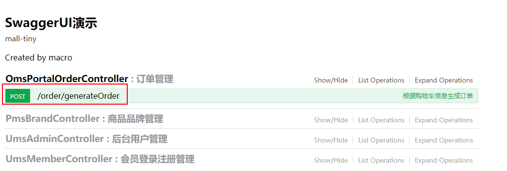

# RabbitMQ实现延迟消息居然如此简单，整个插件就完事了！

> RabbitMQ实现延迟消息的方式有两种，一种是使用`死信队列`实现，另一种是使用`延迟插件`实现。`死信队列`实现我们以前曾经讲过，具体参考[《mall整合RabbitMQ实现延迟消息》](https://mp.weixin.qq.com/s/Rp4TfejQkYN00oQ-kMCRcg)，这次我们讲个更简单的，使用`延迟插件`实现。

## 学前准备

学习本文需要对RabbitMQ有所了解，还不了解的朋友可以看下：[《花了3天总结的RabbitMQ实用技巧，有点东西！》](https://mp.weixin.qq.com/s/qGg3etLnI38i-G8aFbulWw)

## 插件安装

> 首先我们需要下载并安装RabbitMQ的延迟插件。

- 去RabbitMQ的官网下载插件，插件地址：https://www.rabbitmq.com/community-plugins.html

- 直接搜索`rabbitmq_delayed_message_exchange`即可找到我们需要下载的插件，下载和RabbitMQ配套的版本，不要弄错；


- 将插件文件复制到RabbitMQ安装目录的`plugins`目录下；


- 进入RabbitMQ安装目录的`sbin`目录下，使用如下命令启用延迟插件；

```bash
rabbitmq-plugins enable rabbitmq_delayed_message_exchange
```

- 启用插件成功后就可以看到如下信息，之后重新启动RabbitMQ服务即可。


## 实现延迟消息

> 接下来我们需要在SpringBoot中实现延迟消息功能，这次依然沿用商品下单的场景。比如说有个用户下单了，他60分钟不支付订单，订单就会被取消，这就是一个典型的延迟消息使用场景。

- 首先我们需要在`pom.xml`文件中添加`AMQP`相关依赖；

```xml
<!--消息队列相关依赖-->
<dependency>
    <groupId>org.springframework.boot</groupId>
    <artifactId>spring-boot-starter-amqp</artifactId>
</dependency>
```

- 之后在`application.yml`添加RabbitMQ的相关配置；

```yaml
spring:
  rabbitmq:
    host: localhost # rabbitmq的连接地址
    port: 5672 # rabbitmq的连接端口号
    virtual-host: /maple # rabbitmq的虚拟host
    username: maple # rabbitmq的用户名
    password: admin2020 # rabbitmq的密码
    publisher-confirms: true #如果对异步消息需要回调必须设置为true
```

- 接下来创建RabbitMQ的Java配置，主要用于配置交换机、队列和绑定关系；

```java
/**
 * 消息队列配置
 */
@Configuration
public class RabbitMqConfig {

    /**
     * 订单延迟插件消息队列所绑定的交换机
     */
    @Bean
    CustomExchange  orderPluginDirect() {
        //创建一个自定义交换机，可以发送延迟消息
        Map<String, Object> args = new HashMap<>();
        args.put("x-delayed-type", "direct");
        return new CustomExchange(QueueEnum.QUEUE_ORDER_PLUGIN_CANCEL.getExchange(), "x-delayed-message",true, false,args);
    }

    /**
     * 订单延迟插件队列
     */
    @Bean
    public Queue orderPluginQueue() {
        return new Queue(QueueEnum.QUEUE_ORDER_PLUGIN_CANCEL.getName());
    }

    /**
     * 将订单延迟插件队列绑定到交换机
     */
    @Bean
    public Binding orderPluginBinding(CustomExchange orderPluginDirect,Queue orderPluginQueue) {
        return BindingBuilder
                .bind(orderPluginQueue)
                .to(orderPluginDirect)
                .with(QueueEnum.QUEUE_ORDER_PLUGIN_CANCEL.getRouteKey())
                .noargs();
    }

}
```

- 创建一个取消订单消息的发出者，通过给消息设置`x-delay`头来设置消息从交换机发送到队列的延迟时间；

```java
/**
 * 取消订单消息的发出者
 */
@Component
public class CancelOrderSender {
    private static Logger LOGGER =LoggerFactory.getLogger(CancelOrderSender.class);
    @Autowired
    private AmqpTemplate amqpTemplate;

    public void sendMessage(Long orderId,final long delayTimes){
        //给延迟队列发送消息
        amqpTemplate.convertAndSend(QueueEnum.QUEUE_ORDER_PLUGIN_CANCEL.getExchange(), QueueEnum.QUEUE_ORDER_PLUGIN_CANCEL.getRouteKey(), orderId, new MessagePostProcessor() {
            @Override
            public Message postProcessMessage(Message message) throws AmqpException {
                //给消息设置延迟毫秒值
                message.getMessageProperties().setHeader("x-delay",delayTimes);
                return message;
            }
        });
        LOGGER.info("send delay message orderId:{}",orderId);
    }
}
```

- 创建一个取消订单消息的接收者，用于处理订单延迟插件队列中的消息。

```java
/**
 * 取消订单消息的处理者
 */
@Component
@RabbitListener(queues = "maple.order.cancel.plugin")
public class CancelOrderReceiver {
    private static Logger LOGGER =LoggerFactory.getLogger(CancelOrderReceiver.class);
    @Autowired
    private OmsPortalOrderService portalOrderService;
    @RabbitHandler
    public void handle(Long orderId){
        LOGGER.info("receive delay message orderId:{}",orderId);
        portalOrderService.cancelOrder(orderId);
    }
}
```

- 然后在我们的订单业务实现类中添加如下逻辑，当下单成功之前，往消息队列中发送一个取消订单的延迟消息，这样如果订单没有被支付的话，就能取消订单了；

````java
/**
 * 前台订单管理Service
 */
@Service
public class OmsPortalOrderServiceImpl implements OmsPortalOrderService {
    private static Logger LOGGER = LoggerFactory.getLogger(OmsPortalOrderServiceImpl.class);
    @Autowired
    private CancelOrderSender cancelOrderSender;

    @Override
    public CommonResult generateOrder(OrderParam orderParam) {
        //todo 执行一系类下单操作，具体参考maple项目
        LOGGER.info("process generateOrder");
        //下单完成后开启一个延迟消息，用于当用户没有付款时取消订单（orderId应该在下单后生成）
        sendDelayMessageCancelOrder(11L);
        return CommonResult.success(null, "下单成功");
    }

    @Override
    public void cancelOrder(Long orderId) {
        //todo 执行一系类取消订单操作，具体参考maple项目
        LOGGER.info("process cancelOrder orderId:{}",orderId);
    }

    private void sendDelayMessageCancelOrder(Long orderId) {
        //获取订单超时时间，假设为60分钟(测试用的30秒)
        long delayTimes = 30 * 1000;
        //发送延迟消息
        cancelOrderSender.sendMessage(orderId, delayTimes);
    }

}
````

- 启动项目后，在Swagger中调用下单接口；



- 调用完成后查看控制台日志可以发现，从消息发送和消息接收处理正好相差了`30s`，我们设置的延迟时间。

```bash
2020-06-08 13:46:01.474  INFO 1644 --- [nio-8080-exec-1] c.m.m.t.s.i.OmsPortalOrderServiceImpl    : process generateOrder
2020-06-08 13:46:01.482  INFO 1644 --- [nio-8080-exec-1] c.m.m.tiny.component.CancelOrderSender   : send delay message orderId:11
2020-06-08 13:46:31.517  INFO 1644 --- [cTaskExecutor-4] c.m.m.t.component.CancelOrderReceiver    : receive delay message orderId:11
2020-06-08 13:46:31.520  INFO 1644 --- [cTaskExecutor-4] c.m.m.t.s.i.OmsPortalOrderServiceImpl    : process cancelOrder orderId:11
```

## 两种实现方式对比

> 我们之前使用过死信队列的方式，这里我们把两种方式做个对比，先来聊下这两种方式的实现原理。

### 死信队列

死信队列是这样一个队列，如果消息发送到该队列并超过了设置的时间，就会被转发到设置好的处理超时消息的队列当中去，利用该特性可以实现延迟消息。

### 延迟插件

通过安装插件，自定义交换机，让交换机拥有延迟发送消息的能力，从而实现延迟消息。

### 结论

由于死信队列方式需要创建两个交换机（死信队列交换机+处理队列交换机）、两个队列（死信队列+处理队列），而延迟插件方式只需创建一个交换机和一个队列，所以后者使用起来更简单。

## 项目源码地址

https://github.com/macrozheng/mall-learning/tree/master/mall-tiny-delay

