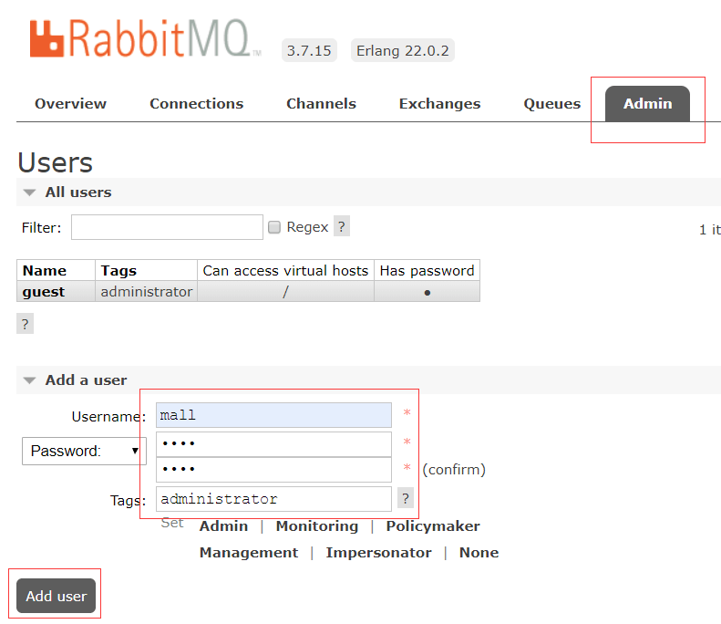
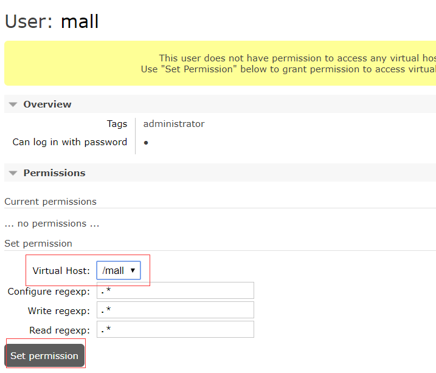
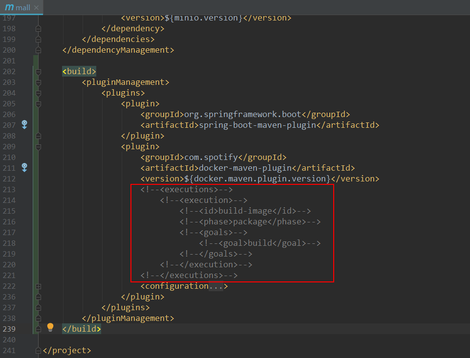
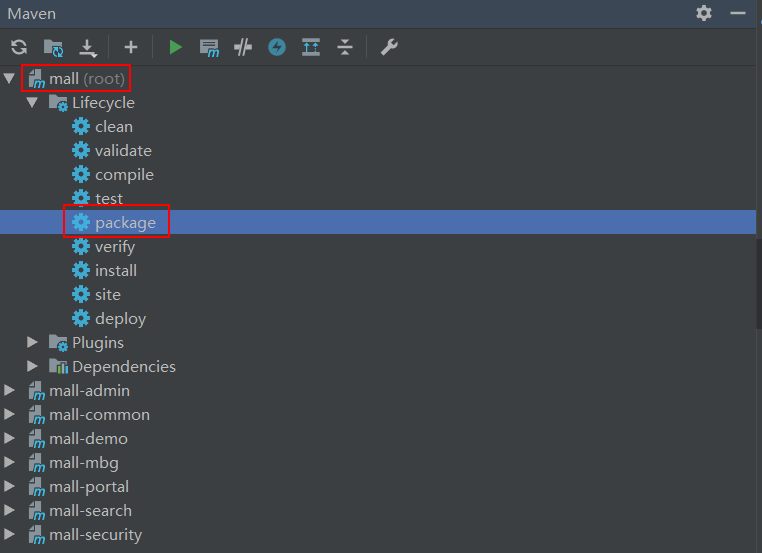
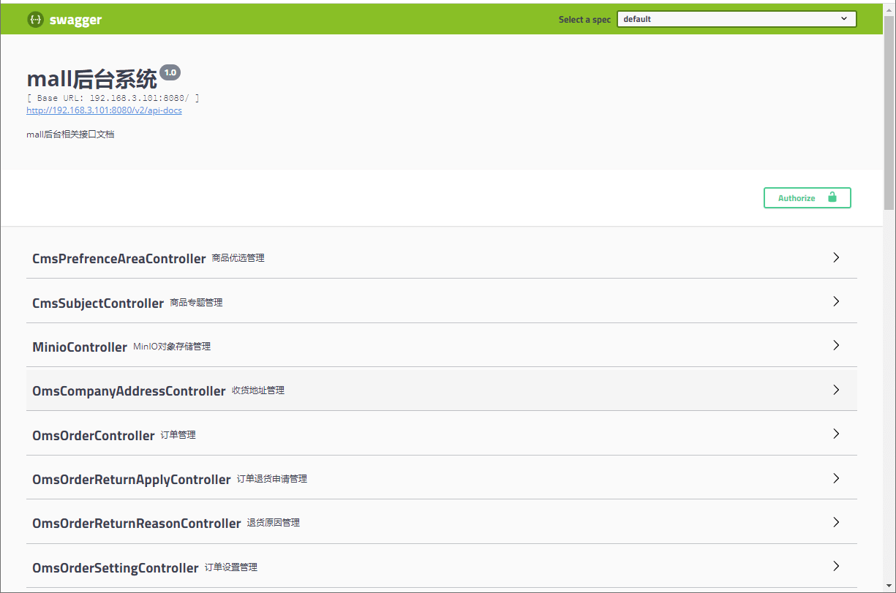
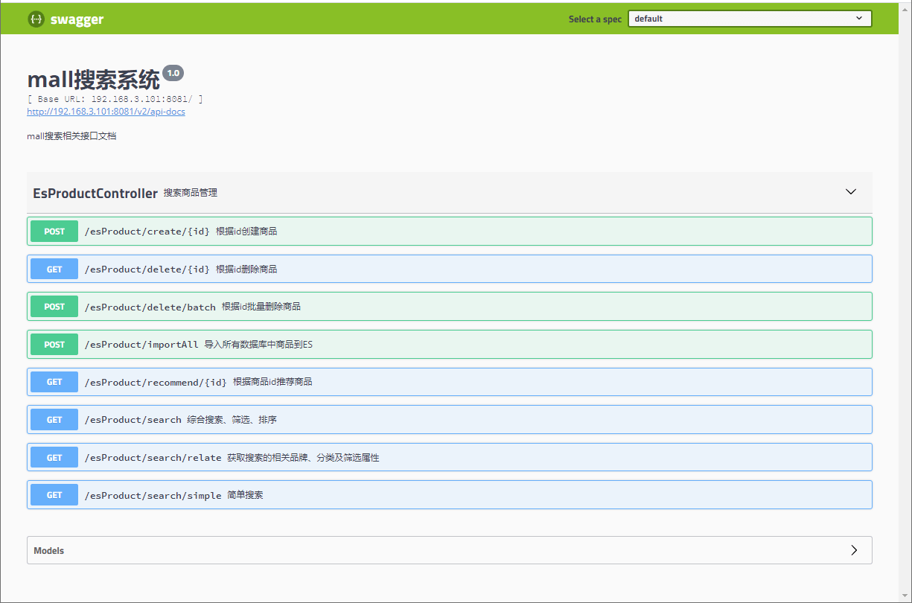
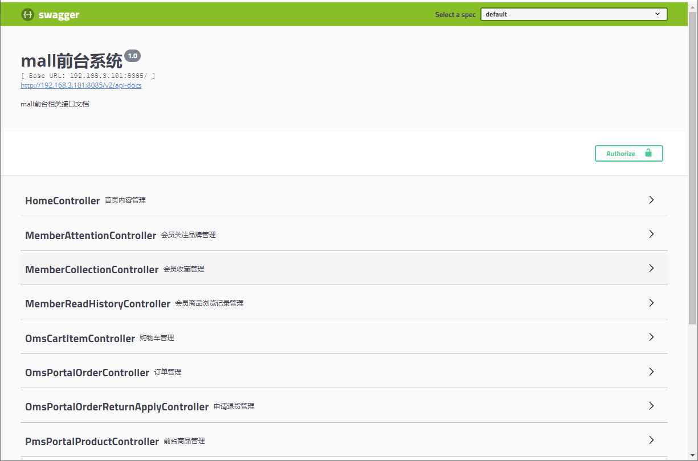

学习不走弯路，[关注公众号](#公众号) 回复「学习路线」，获取mall项目专属学习路线！

# mall在Linux环境下的部署（基于Docker容器）

> 本文主要以图文的形式讲解mall在Linux环境下的部署，涉及在Docker容器中安装MySQL、Redis、Nginx、RabbitMQ、MongoDB、Elasticsearch、Logstash、Kibana，以及SpringBoot应用部署，基于`CenterOS7.6`。

## Docker环境安装

- 安装`yum-utils`：

```bash
yum install -y yum-utils device-mapper-persistent-data lvm2
```

- 为yum源添加docker仓库位置：

```bash
yum-config-manager --add-repo https://download.docker.com/linux/centos/docker-ce.repo
```

- 安装docker：

```bash
yum install docker-ce
```

## 启动docker(以下所有依赖docker命令都要事先启动docker进程,docker启动后会保持运行,直到使用停止命令将这个进程结束)

```bash
systemctl start docker
```

## MySQL安装

- 下载MySQL`8.0.15`的docker镜像(获取一个新镜像: docker pull 镜像名:镜像版本)：

```bash
docker pull mysql:8.0.15
```

- 使用如下命令启动MySQL服务(运行镜像: docker run 镜像名:镜像版本)：

    

```bash
docker run -p 3306:3306 --name mysql \
-v /mydata/mysql/log:/var/log/mysql \
-v /mydata/mysql/data:/var/lib/mysql \
-v /mydata/mysql/conf:/etc/mysql \
-v /mydata/mysql/mysql-files:/var/lib/mysql-files \
-e MYSQL_ROOT_PASSWORD=root  \
-d mysql:8.0.15

```

- 参数说明

  表示将镜像mysql:8.0.15使用docker run运行

  

  [Docker run 命令 | 菜鸟教程 (runoob.com)](https://www.runoob.com/docker/docker-run-command.html)

  - -p 3306:3306：将容器的3306端口映射到主机的3306端口
  - --volume , -v: 绑定一个卷
  - --name mysql:  (重命名)命名该运行的(容器)进程的名称为mysql
  - -v /mydata/mysql/conf:/etc/mysql：将容器中的配置文件夹(/etc/mysql)挂载到主机(/mydata/mysql/conf)
  - -v /mydata/mysql/log:/var/log/mysql：将日志文件夹挂载到主机
  - -v /mydata/mysql/data:/var/lib/mysql/：将数据文件夹挂载到主机
  - **-v /mydata/mysql/mysql-files:/var/lib/mysql-files** 别缺少,否则在后面的`docker exec -it mysql /bin/bash`命令中会有报错
  - -e MYSQL_ROOT_PASSWORD=root：初始化root用户的密码
  - -d mysql:8.0.15:                    -d表示(容器的)进程在后台一直运行

[docker上安装卸载mysql_笨菜先飞的博客-CSDN博客_docker卸载mysql](https://blog.csdn.net/qq_41510551/article/details/112618799)

```bash
docker rm 4d7f7420b912 （这个是CONTAINER ID）    //移除
docker rmi 镜像名:镜像版本  //删除对应镜像名的镜像
//再创建新容器
docker run --name mysqlserver 
-v $PWD/conf:/etc/mysql/conf.d 
-v $PWD/logs:/logs 
-v $PWD/data:/var/lib/mysql 
-e MYSQL_ROOT_PASSWORD=123456  
-i -p 3306:3306 mysql:8.0.15
//查看
docker ps -a
```

```bash
//查看docker上的镜像
docker images
//查看docker上的实例情况
docker ps -a
docker ps //只能看到运行的实例
//重启实例
docker restart ebc54f9f98e2（CONTAINER ID）
//停止实例
docker stop ebc54f9f98e2（CONTAINER ID）
```


- 进入运行MySQL的docker容器：

```bash
//进入运行MySQL的docker容器
cd /var/lib/docker/containers/
//在运行中的容器中执行命令:docker exec [OPTIONS] CONTAINER COMMAND [ARG...] 
//命令网址:https://www.runoob.com/docker/docker-exec-command.html
//在容器 mysql 中开启一个交互模式的终端
docker exec -it mysql /bin/bash
//可以使用exit退出这个交互模式的终端
exit
```

`docker exec -it mysql /bin/bash`命令中

-   **-i**: 交互式操作。
-   **-t**: 终端。
-   **mysql :8.0.15**: 这是指用 mysql :8.0.15 版本镜像为基础来启动容器,版本可省略。
-   **/bin/bash**：放在镜像名后的是命令，这里我们希望有个交互式 Shell，因此用的是 /bin/bash。

**出现错误**

```bash
docker exec -it mysql /bin/bash
Error response from daemon: Container c7f99ec1c8ff04d03556c866a3217f895eaf49cf47f3af82ce81ffc13e4c70e2 is not running
```

使用 `docker logs c7f99ec1c8ff04d03556c866a3217f895eaf49cf47f3af82ce81ffc13e4c70e2`查看日志,看为啥出现错误

mysqld: Error on realpath() on '/var/lib/mysql-files' (Error 2 - No such file or directory)

当指定了外部配置文件与外部存储路径时，也需要指定 /var/lib/mysql-files的外部目录，

　　所以在 主机新建/mydata/mysql/mysql-files目录，

　　在启动容器时 需要加上

`-v /mydata/mysql/mysql-files:/var/lib/mysql-files`

在使用docker rm命令将进程移除后，使用如下命令重新配置启动

```bash

docker run -p 3306:3306 --name mysql \
-v /mydata/mysql/log:/var/log/mysql \
-v /mydata/mysql/data:/var/lib/mysql \
-v /mydata/mysql/conf:/etc/mysql \
-v /mydata/mysql/mysql-files:/var/lib/mysql-files \
-e MYSQL_ROOT_PASSWORD=root  \
-d mysql:8.0.15
```


- 使用MySQL命令打开客户端：

```bash
mysql -uroot -proot --default-character-set=utf8
```

- 创建maple数据库：

```sql
create database maple character set utf8
```

- 打开第二个终端,将maple.sql文件从下载的区域拷贝到/mydata目录下

比如我是从windows和centos之间的共享文件夹拷贝

`cp -r /mnt/hgfs/IntraWindowsAndLinuxShare/maple.sql /mydata`

- ~~或者使用第二个终端,安装上传下载插件，并将`document/sql/maple.sql`使用在线的方式上传到Linux服务器上：~~

```bash
yum -y install lrzsz
```

- 第二个终端,将`maple.sql`文件拷贝到mysql容器的`/`目录下：

```bash
docker cp /mydata/maple.sql mysql:/
```

- 使用第一个终端,将sql文件导入到数据库：

```bash
use maple;
source /maple.sql;
```

- 设置远程连接权限: 创建一个`reader:123456`帐号并修改权限，使得任何ip都能访问：

```sql
//mysql8.0之前的语句
grant all privileges on *.* to 'reader' @'%' identified by '123456';
//mysql8.0之后的语句
create user reader@'%' identified by '123456'; grant all privileges on *.* to reader@'%' with grant option;
```

## Redis安装

- 下载Redis`5.0`的docker镜像：

```bash
docker pull redis:5
```

- 使用如下命令启动Redis服务：

```bash
docker run -p 6379:6379 --name redis \
-v /mydata/redis/data:/data \
-d redis:5 redis-server --appendonly yes
```

- 进入Redis容器使用`redis-cli`命令进行连接：

```bash
docker exec -it redis redis-cli
```


## Nginx安装

- 下载Nginx`1.10`的docker镜像：

```bash
docker pull nginx:1.10
```

- 先运行一次容器（为了拷贝配置文件）：

```bash
docker run -p 80:80 --name nginx \
-v /mydata/nginx/html:/usr/share/nginx/html \
-v /mydata/nginx/logs:/var/log/nginx  \
-d nginx:1.10
```

- 将容器内的配置文件拷贝到指定目录：

```bash
docker container cp nginx:/etc/nginx /mydata/nginx/
```

- 进入到linux下的nginx中

`cd /mydata/nginx/`

修改文件名称：

```bash
mv nginx conf
```

- 终止并删除容器：

```bash
docker stop nginx
docker rm nginx
```

- 使用如下命令启动Nginx服务：

```bash
docker run -p 80:80 --name nginx \
-v /mydata/nginx/html:/usr/share/nginx/html \
-v /mydata/nginx/logs:/var/log/nginx  \
-v /mydata/nginx/conf:/etc/nginx \
-d nginx:1.10
```

## RabbitMQ安装

- 下载rabbitmq`3.7.15`的docker镜像：

```bash
docker pull rabbitmq:3.7.15
```

- 使用如下命令启动RabbitMQ服务：

```bash
docker run -p 5672:5672 -p 15672:15672 --name rabbitmq \
-d rabbitmq:3.7.15
```

[消息中间件RabbitMQ需要知道的6个端口的作用_i++;-CSDN博客_rabbitmq需要开放的端口](https://blog.csdn.net/qq_37356556/article/details/104700411)

| 端口       | 作用                                                         |
| ---------- | ------------------------------------------------------------ |
| 15672      | 管理界面ui使用的端口,使用http://localhost:15672打开管理界面  |
| 15671      | 管理监听端口                                                 |
| 5672, 5671 | AMQP 0-9-1 without and with TLS(Transport Layer Security) client端通信口 |
| 4369       | （epmd)epmd代表 Erlang端口映射守护进程，erlang发现口         |
| 25672      | ( Erlang distribution） server间内部通信口                   |

- 进入容器并开启管理功能：

```bash
docker exec -it rabbitmq /bin/bash
rabbitmq-plugins enable rabbitmq_management
```


- 开启防火墙：

```bash
firewall-cmd --zone=public --add-port=15672/tcp --permanent
firewall-cmd --reload
```
- 访问地址查看是否安装成功：http://localhost:15672


- 输入账号密码并登录：guest guest

- 创建帐号并设置其角色为管理员：mall mall



- 创建一个新的虚拟host为：/mall


- 点击mall用户进入用户配置页面


- 给mall用户配置该虚拟host的权限



## Elasticsearch安装

- 下载Elasticsearch`7.6.2`的docker镜像：

```bash
docker pull elasticsearch:7.6.2
```

- 修改虚拟内存区域大小，否则会因为过小而无法启动:

[systemctl VS sysctl VS service VS init.d | 大专栏 (dazhuanlan.com)](https://www.dazhuanlan.com/2019/12/13/5df2f21849302/)

sysctl命令被用于在内核运行时动态地修改内核的运行参数，可用的内核参数在目录/proc/sys中。它包含一些TCP/ip堆栈和虚拟内存系统的高级选项， 这可以让有经验的管理员提高引人注目的系统性能。用sysctl可以读取设置超过五百个系统变量。

```bash
sysctl -w vm.max_map_count=262144
```

- 使用如下命令启动Elasticsearch服务：

```bash
docker run -p 9200:9200 -p 9300:9300 --name elasticsearch \
-e "discovery.type=single-node" \
-e "cluster.name=elasticsearch" \
-v /mydata/elasticsearch/plugins:/usr/share/elasticsearch/plugins \
-v /mydata/elasticsearch/data:/usr/share/elasticsearch/data \
-d elasticsearch:7.6.2
```

9200 是ES节点与外部通讯使用的端口。它是http协议的RESTful接口（各种CRUD操作都是走的该端口,如查询：http://localhost:9200/user/_search）。
9300是ES节点之间通讯使用的端口。它是tcp通讯端口，集群间和TCPclient都走的它。（java程序中使用ES时，在配置文件中要配置该端口）

- 启动时会发现`/usr/share/elasticsearch/data`目录没有访问权限，只需要修改`/mydata/elasticsearch/data`目录的权限，再重新启动即可；

```bash
chmod 777 /mydata/elasticsearch/data/
```

- 安装中文分词器IKAnalyzer，并重新启动：

```bash
docker exec -it elasticsearch /bin/bash
#此命令需要在容器中运行
elasticsearch-plugin install https://github.com/medcl/elasticsearch-analysis-ik/releases/download/v7.6.2/elasticsearch-analysis-ik-7.6.2.zip
docker restart elasticsearch
```

- 开启防火墙：

```bash
firewall-cmd --zone=public --add-port=9200/tcp --permanent
firewall-cmd --reload
```

- 访问会返回版本信息：http://localhost:9200


## Logstash安装

- 下载Logstash`7.6.2`的docker镜像：

```bash
docker pull logstash:7.6.2
```

- 修改Logstash的配置文件`logstash.conf`中`output`节点下的Elasticsearch连接地址为`es:9200`，配置文件地址：https://github.com/macrozheng/mall/blob/master/document/elk/logstash.conf

```
output {
  elasticsearch {
    hosts => "es:9200"
    index => "mall-%{type}-%{+YYYY.MM.dd}"
  }
}
```

- 创建`/mydata/logstash`目录，并将Logstash的配置文件`logstash.conf`拷贝到该目录；

```bash
mkdir /mydata/logstash
```

- 使用如下命令启动Logstash服务；

```bash
docker run --name logstash -p 4560:4560 -p 4561:4561 -p 4562:4562 -p 4563:4563 \
--link elasticsearch:es \
-v /mydata/logstash/logstash.conf:/usr/share/logstash/pipeline/logstash.conf \
-d logstash:7.6.2
```

- 进入容器内部，安装`json_lines`插件。

```bash
logstash-plugin install logstash-codec-json_lines
```

## Kibana安装

- 下载Kibana`7.6.2`的docker镜像：

```bash
docker pull kibana:7.6.2
```

- 使用如下命令启动Kibana服务：

```bash
docker run --name kibana -p 5601:5601 \
--link elasticsearch:es \
-e "elasticsearch.hosts=http://es:9200" \
-d kibana:7.6.2
```

- 开启防火墙：

```bash
firewall-cmd --zone=public --add-port=5601/tcp --permanent
firewall-cmd --reload
```
- 访问地址进行测试：http://192.168.3.101:5601


## MongoDB安装

- 下载MongoDB`4.2.5`的docker镜像：

```bash
docker pull mongo:4.2.5
```

- 使用docker命令启动：

```bash
docker run -p 27017:27017 --name mongo \
-v /mydata/mongo/db:/data/db \
-d mongo:4.2.5
```

## Docker全部环境安装完成

- 所有下载镜像文件：

使用 `docker images` 查看所有下载的镜像文件

```bash
REPOSITORY            TAG                 IMAGE ID            CREATED             SIZE
redis                 5                   071538dbbd71        2 weeks ago         98.3MB
mongo                 4.2.5               fddee5bccba3        3 months ago        388MB
logstash              7.6.2               fa5b3b1e9757        4 months ago        813MB
kibana                7.6.2               f70986bc5191        4 months ago        1.01GB
elasticsearch         7.6.2               f29a1ee41030        4 months ago        791MB
rabbitmq              3.7.15-management   6ffc11daa8d0        13 months ago       186MB
mysql                 5.7                 7faa3c53e6d6        15 months ago       373MB
registry              2                   f32a97de94e1        17 months ago       25.8MB
nginx                 1.10                0346349a1a64        3 years ago         182MB
java                  8                   d23bdf5b1b1b        3 years ago         643MB
```

- 所有运行在容器里面的应用：

    使用 `docker ps` 查看所有运行在容器中的应用

    可以使用 `docker start 镜像名1:镜像版本 镜像名2:镜像版本 ...同时启动这些应用`,镜像版本可省略

    如

    ```bash
    docker start redis mongo elasticsearch kibana rabbitmq mysql nginx logstash
    ```

    


## SpringBoot应用部署(windows上使用docker打包,所以也要配置一下windows的docker)

### **Idea 连接 CentOS7虚拟机中的Docker**

[IntelliJ IDEA中配置和使用Docker - 知乎 (zhihu.com)](https://zhuanlan.zhihu.com/p/125680010)

docker需要的windows 的Hyper v与VMware不需要Hyper v起了冲突,解决办法

[不能打架！不能打架！Hyper-V终于可以跟其他虚拟机兼容啦！ - 哔哩哔哩专栏 (bilibili.com)](https://www.bilibili.com/read/cv5710758/)

[使用Docker时，Windows10 VMware与Hyper-V冲突解决以及Device Guard问题_BoCong-Deng的博客-CSDN博客](https://blog.csdn.net/dbc_121/article/details/103893031)

### 构建所有Docker镜像并上传

- 修改项目根目录下的`pom.xml`中的`docker.host`属性：

```xml
<properties>
    <docker.host>http://localhost:2375</docker.host>
</properties>
```

- 如果项目根目录的`pom.mxl`中`docker-maven-plugin`的`<executions>`节点被注释掉了就打开注释，使项目在打包时直接构建Docker镜像；



- 在idea右边的maven选项中,直接双击根项目`mall`的`package`命令可以一次性打包所有应用的Docker镜像；




```bash
REPOSITORY            TAG                 IMAGE ID            CREATED              SIZE
mall/mall-portal      1.0-SNAPSHOT        70e0f76416a0        21 seconds ago       705MB
mall/mall-search      1.0-SNAPSHOT        f3290bd1d0c7        41 seconds ago       725MB
mall/mall-admin       1.0-SNAPSHOT        26557b93a106        About a minute ago   705MB
```

**项目场景**：

[idea 连接远程docker_TianXieZuoMaiKong的博客-CSDN博客](https://blog.csdn.net/TianXieZuoMaiKong/article/details/107287210)

springboot项目集成docker插件进行打包

**问题描述**：
springboot项目集成docker用插件打包时报错：

```
[ERROR] Failed to execute goal com.spotify:docker-maven-plugin:1.1.0:build (build-imag) on project mall-tiny-docker: Exception caught: 
java.util.concurrent.ExecutionException: com.spotify.docker.client.shaded.javax.ws.rs.ProcessingException: 
org.apache.http.conn.HttpHostConnectException: Connect to localhost:2375 [localhost/127.0.0.1, localhost/0:0:0:0:0:0:0:1] failed: Connection 
refused: connect -> [Help 1]
```

【Docker】在本地打包maven程序为docker镜像报错： Connect to localhost:2375 [localhost/127.0.0.1, localhost/0:0:0:0:0:0:0:1\] - 冰河团队 - 博客园 (cnblogs.com)](https://www.cnblogs.com/binghe001/p/12885714.html)

**原因分析**：

我的错误原因是我没有打开本地的docker 2375端口。windows本地没有打开docker2375端口

**解决方案**：

(a)windows本地下载docker for windows(现在称为docker desktop):

Docker Desktop 官方下载地址： https://hub.docker.com/editions/community/docker-ce-desktop-windows

(b)双击下载的 Docker for Windows Installer 安装文件，一路 Next，点击 Finish 完成安装。

[IntelliJ IDEA中配置和使用Docker - 知乎 (zhihu.com)](https://zhuanlan.zhihu.com/p/125680010)

(c)如果启动docker desktop过程中遇到因 WSL 2 导致地错误，请根据提示安装 [WSL 2](https://docs.microsoft.com/zh-cn/windows/wsl/install-win10)。

直接默认安装wsl 2,然后点击弹窗提示的restart


docker主机端(linux端)

```bash
##查看docker 的配置文件在哪
systemctl show --property=FragmentPath docker


## 修改docker服务文件

vim  /lib/systemd/system/docker.service
##或者使用gedit来编辑
gedit  /lib/systemd/system/docker.service
## 将原来的ExecStart前面加上#号注释掉，然后再下面追加一行

ExecStart=/usr/bin/dockerd -H tcp://0.0.0.0:2375 -H unix:///var/run/docker.sock

## 重新加载配置

systemctl daemon-reload

## 重启docker服务

systemctl restart docker.service
```

[Failed to execute goal com.spotify:docker-maven-plugin:0.4.13:build (default-cli)..._Willian的博客屋-CSDN博客](https://blog.csdn.net/fragrant_no1/article/details/84326155)

若还是出现

`Failed to execute goal com.spotify:docker-maven-plugin:1.1.0:build (build-image) on project mall-tiny-docker: Exception caught`

说明是docker-maven-plugin的版本问题，需要使用最新版,在pom.xml中改成最新版就行

### 部署mall-admin

```bash
docker run -p 8080:8080 --name mall-admin \
--link mysql:db \
--link redis:redis \
-v /etc/localtime:/etc/localtime \
-v /mydata/app/admin/logs:/var/logs \
-d mall/mall-admin:1.0-SNAPSHOT
```

`注意`：如果想使用Logstash收集日志的话，需要将应用容器连接到Logstsh，添加如下配置即可；

```bash
--link logstash:logstash \
```

### 部署mall-search

```bash
docker run -p 8081:8081 --name mall-search \
--link elasticsearch:es \
--link mysql:db \
-v /etc/localtime:/etc/localtime \
-v /mydata/app/search/logs:/var/logs \
-d mall/mall-search:1.0-SNAPSHOT
```

### 部署mall-port

```bash
docker run -p 8085:8085 --name mall-portal \
--link mysql:db \
--link redis:redis \
--link mongo:mongo \
--link rabbitmq:rabbit \
-v /etc/localtime:/etc/localtime \
-v /mydata/app/portal/logs:/var/logs \
-d mall/mall-portal:1.0-SNAPSHOT
```

### 开启防火墙

```bash
firewall-cmd --zone=public --add-port=8080/tcp --permanent
firewall-cmd --zone=public --add-port=8081/tcp --permanent
firewall-cmd --zone=public --add-port=8085/tcp --permanent
firewall-cmd --reload
```

### 访问接口进行测试

- mall-admin的api接口文档地址：http://192.168.3.101:8080/swagger-ui.html



- mall-search的api接口文档地址：http://192.168.3.101:8081/swagger-ui.html



- mall-portal的api接口文档地址：http://192.168.3.101:8085/swagger-ui.html



## 公众号


