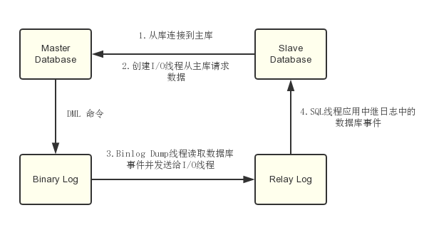
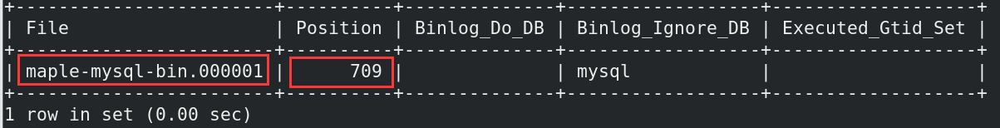
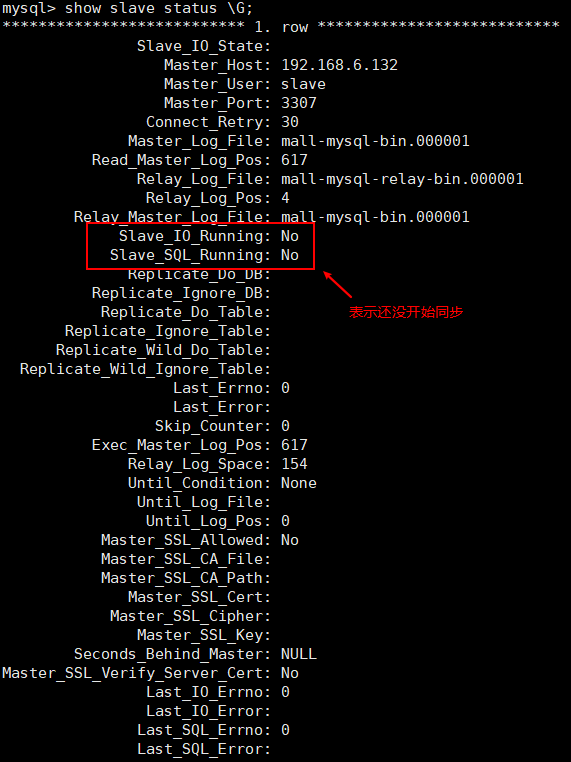
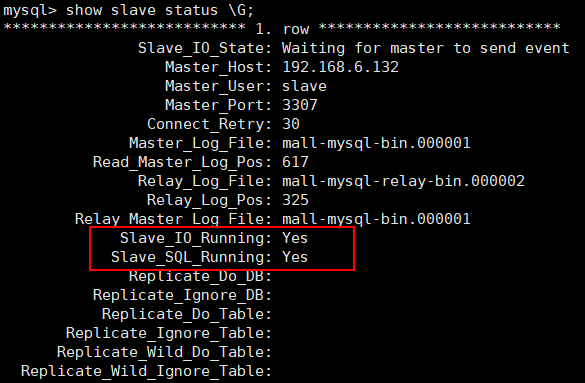
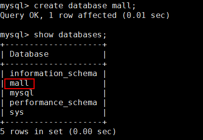
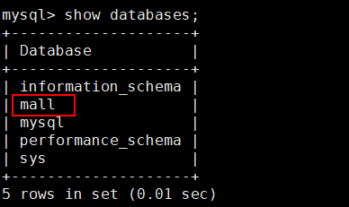

# MySql主从复制，从原理到实践！

> 本文将从MySql主从复制的原理出发，详细介绍MySql在Docker环境下的主从复制搭建，以一个主实例和一个从实例实现主从复制为例。

## 什么是主从复制？

主从复制是指将主数据库的DDL和DML操作通过二进制日志传到从数据库上，然后在从数据库上对这些日志进行重新执行，从而使从数据库和主数据库的数据保持一致。

## 主从复制的原理

- MySql主库在事务提交时会把数据变更作为事件记录在二进制日志Binlog中；
- 主库推送二进制日志文件Binlog中的事件到从库的中继日志Relay Log中，之后从库根据中继日志重做数据变更操作，通过逻辑复制来达到主库和从库的数据一致性；
- MySql通过三个线程来完成主从库间的数据复制，其中Binlog Dump线程跑在主库上，I/O线程和SQL线程跑着从库上；
- 当在从库上启动复制时，首先创建I/O线程连接主库，主库随后创建Binlog Dump线程读取数据库事件并发送给I/O线程，I/O线程获取到事件数据后更新到从库的中继日志Relay Log中去，之后从库上的SQL线程读取中继日志Relay Log中更新的数据库事件并应用(这里的更新并应用 表示两阶段提交)，如下图所示。



## 主实例搭建(与在docker搭建mysql一致,注意一下运行的mysql服务的服务名称和端口号要唯一就行(避免覆盖配置以及端口占用),只是多了一个配置文件my.cnf)

主从复制实践: https://developer.aliyun.com/article/744929

- 运行mysql主实例：

```bash
docker run -p 3307:3306 --name mysql-master \
-v /mydata/mysql-master/log:/var/log/mysql \
-v /mydata/mysql-master/data:/var/lib/mysql \
-v /mydata/mysql-master/conf:/etc/mysql \
-v /mydata/mysql-master/mysql-files:/var/lib/mysql-files \
-e MYSQL_ROOT_PASSWORD=root  \
-d mysql:8.0.15
```

- 在mysql的配置文件夹`/mydata/mysql-master/conf`中创建一个配置文件`my.cnf`：

```bash
touch my.cnf
## 或者直接使用下面的语句
sudo vim /mydata/mysql-master/conf/my.cnf
```

- 修改配置文件my.cnf，配置信息如下(要进行主从复制,主数据库一定要开启`log-bin`)：

```bash
[mysqld]
## 设置端口号, 不是必要的参数, 因为这会在搭建mysql实例就会将容器中的端口号映射到主机上的端口号上
## port=3306
## 设置server_id, 保证在同一局域网中的server_id唯一
server_id=101
## 指定不需要同步的数据库名称(如每个mysql服务中的系统自带的数据库mysql)
binlog-ignore-db=mysql
## 根据指定的名称 开启二进制日志功能    要进行主从复制,主数据库一定要开启log-bin!!!!!!!!!!!!!!!!!!!
log-bin=maple-mysql-bin
## 设置二进制日志使用内存的大小(即记录事物变更数据的历史)
binlog_cache_size=1M
## 设置使用的二进制日志格式(三种: mixed, statement, row)
binlog_format=mixed
## 设置二进制日志过期清理的时间.默认值为0,表示不自动清理
expire_logs_days=7
## 跳过主从复制中遇到的所有错误或者指定类型的错误,避免slave端因错误而使得复制被中断.
## 如: 1062错误指的是一些主键重复, 1032错误指的是主从数据库数据不一致
slave_skip_errors=1062

```

- 修改完配置后重启实例：

```bash
docker restart mysql-master
```

- 进入`mysql-master`容器中：

```bash
docker exec -it mysql-master /bin/bash
```

- 在容器中使用mysql的登录命令连接到客户端：

```bash
mysql -uroot -proot
```

- 创建数据同步用户：

```bash
create user 'slave'@'%' identified by '123456';## 创建用户
grant replication slave,replication client on *.* to 'slave'@'%';## 设置用户权限
flush privileges;## 刷新权限
show grants for 'slave'@'%';## 查看用户权限

## 若出现创建用户失败  ROR 1396 (HY000): Operation CREATE USER failed for 'slave'@'%'
## 使用如下进行删除原来可能已经创建过的用(参考自https://www.cnblogs.com/zhjh256/p/11613018.html)
drop user slave@'%';
flush privileges;## 不可以缺少
```

## 从实例搭建(与在docker搭建mysql一致,注意一下运行的mysql服务的服务名称和端口号要唯一就行(避免覆盖配置以及端口占用),只是多了一个配置文件my.cnf)

- 运行mysql从实例：

```bash
docker run -p 3308:3306 --name mysql-slave \
-v /mydata/mysql-slave/log:/var/log/mysql \
-v /mydata/mysql-slave/data:/var/lib/mysql \
-v /mydata/mysql-slave/conf:/etc/mysql \
-v /mydata/mysql-slave/mysql-files:/var/lib/mysql-files \
-e MYSQL_ROOT_PASSWORD=root  \
-d mysql:8.0.15
```

- 在mysql的配置文件夹`/mydata/mysql-slave/conf`中创建一个配置文件`my.cnf`：

```bash
## 一定要进入正确的路径进行配置,刚刚是新建了mysql-slave容器,所以要进入mysql-slave/conf下,而不是之前的主数据库的mysql-master/conf下
touch my.cnf
## 或者直接使用下面的语句
sudo vim /mydata/mysql-slave/conf/my.cnf
```

- 修改配置文件my.cnf：

```bash
[mysqld]
## 设置端口号, 不是必要的参数, 因为这会在搭建mysql实例就会将容器中的端口号映射到主机上的端口号上
## port=3306
## 设置server_id，同一局域网中需要唯一
server_id=102
## 指定不需要同步的数据库名称
binlog-ignore-db=mysql  
## 开启二进制日志功能，以备Slave作为其它数据库实例的Master时使用
log-bin=maple-mysql-slave1-bin  
## 设置二进制日志使用内存大小（事务）
binlog_cache_size=1M  
## 设置使用的二进制日志格式（mixed,statement,row）
binlog_format=mixed  
## 二进制日志过期清理时间。默认值为0，表示不自动清理。
expire_logs_days=7  
## 跳过主从复制中遇到的所有错误或指定类型的错误，避免slave端复制中断。
## 如：1062错误是指一些主键重复，1032错误是因为主从数据库数据不一致
slave_skip_errors=1062  
## relay_log配置中继日志
relay_log=maple-mysql-relay-bin  
## log_slave_updates表示slave将复制事件写进自己的二进制日志
log_slave_updates=1  
## slave设置为只读（具有super权限的用户除外）
read_only=1  
```

- 修改完配置后重启实例：

```bash
docker restart mysql-slave
```

## 将主从数据库进行连接(只要配置了连接,各数据库只要在运行时就可以进行主从复制,重启之后一样会根据之前的配置进行连接,重启之后会自动打开曾经手动关闭(使用stop slave命令关闭)的slave)

- 进入`mysql-slave`容器中(该命令与主从复制无关,用于打开数据库交互界面)：

```bash
docker exec -it mysql-slave /bin/bash
```

- 在容器中使用mysql的登录命令连接到客户端(该命令与主从复制无关,用于登录到数据库)：

```bash
mysql -uroot -proot
```

- 连接到**主数据库**的mysql客户端，查看主数据库状态：

```bash
show master status;
```

- **主数据库**状态显示如下：




- 在**从数据库**中配置主从复制(这是在登录从数据库后,进行连接设置)：

若是手误在主数据库执行了以下语句,应使用链接中的方法来取消[MySQL5.7彻底取消主从复制 - godfather007 - 博客园 (cnblogs.com)](https://www.cnblogs.com/godfather007/p/10584996.html)

```bash
## 在从数据库中进行操作
change master to master_host='172.17.0.2', master_user='slave', master_password='123456', master_port=3306, master_log_file='maple-mysql-bin.000001', master_log_pos=709, master_connect_retry=30;  

## 若是在主数据库中执行了如上语句,应在主数据库中执行如下语句进行取消
stop slave;## 停止刚刚使用start命令开始的slave服务
reset slave all;## 重置该数据库服务上的所有slave从服务
show slave status \G ## 查看是否重置完成  若输出  Empty set (0.00 sec) 则表示重置完成

```


- 主从复制命令参数说明：
    - master_host：主数据库的IP地址；是容器mysql-master的ip地址, 在使用`docker exec -it mysql-master /bin/bash`交互界面时, 使用`cat /etc/hosts`命令获得;也可以使用命令`docker inspect 容器id| grep Address` 查看运行中的容器的ip
    - master_port：主数据库的运行端口, 这里是容器的端口号, 即`docker run -p 3308:3306`中冒号后面的端口号；
    - master_user：在主数据库创建的用于同步数据的用户账号；
    - master_password：在主数据库创建的用于同步数据的用户密码；
    - master_log_file：指定从数据库要复制数据的日志文件，通过查看主数据的状态，获取File参数；
    - master_log_pos：指定从数据库从哪个位置开始复制数据，通过查看主数据的状态，获取Position参数；
    - master_connect_retry：连接失败重试的时间间隔，单位为秒。
- 查看主从同步状态(需要在**从数据库**上的交互终端上查看)：

```bash
## 需要在从数据库上的交互终端上查看,这里不用在语句结尾加分号
show slave status \G
```

- **从数据库**状态显示如下：



- 开启主从同步：

```bash
start slave;
```

- 若出现Slave_IO_Running: Connecting   和 Error_code: 2003 则参考如下两个链接~~https://blog.csdn.net/Wuhaotian1996/article/details/86714340 (加了端口,出现了下面第二个链接中的错误)~~ 和https://blog.csdn.net/chengyuqiang/article/details/54285857

一个mysql远程登录docker上另一个地址的mysql的指令`mysql -h172.17.0.2 -uroot -proot` ,不用加端口: https://blog.csdn.net/a5nan/article/details/72864249

ERROR 2003 (HY000): Can't connect to MySQL server问题,解决办法总结：

1、确定远程机器的防火墙关闭，或在防火墙允许3306端口号

2、确定数据库允许远程访问，通过语句grant all privileges on *.* to 'root'@'%' identified by '123456'即可。

3、如果上面方法还是没有解决。直接kill进程，重启。

- 查看从数据库状态发现已经同步：



## 主从复制测试(连接正常之后的从数据库才会看到效果)

> 主从复制的测试方法有很多，可以在主实例中创建一个数据库，看看从实例中是否有该数据库，如果有，表示主从复制已经搭建成功。

- 在主实例中创建一个数据库`mall`；



- 在从实例中查看数据库，发现也有一个`mall`数据库，可以判断主从复制已经搭建成功。




